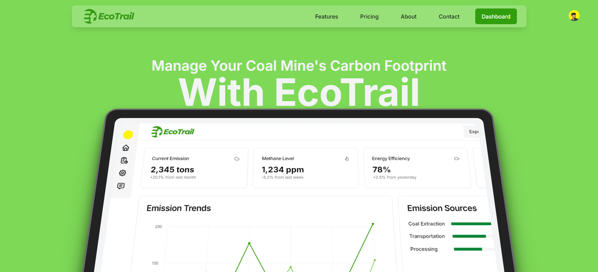
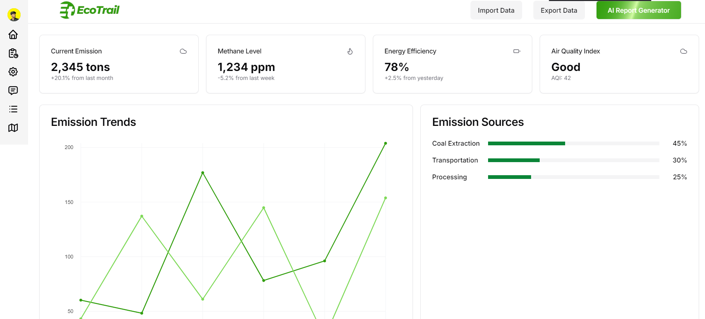
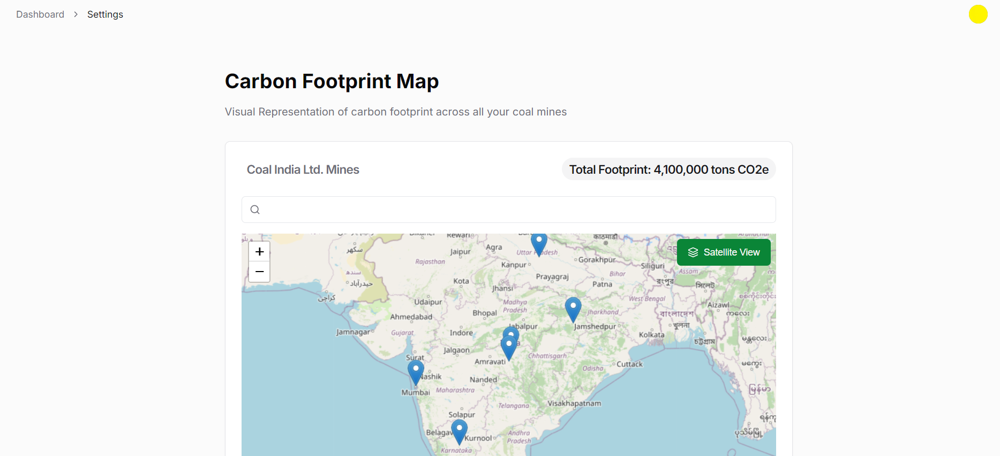

# EcoTrail

EcoTrail is an AI-powered web application designed to help Indian coal mines quantify their carbon footprint and explore pathways to carbon neutrality. By providing actionable insights, data visualizations, and sustainability recommendations, EcoTrail empowers mine operators to meet their sustainability goals while optimizing operations.

## 🚀 Features

### **Emission Analysis**

- **Activity-wise Carbon Emissions:** Quantify carbon emissions for various mining activities.
- **Per Capita Emissions:** Measure emissions on a per capita basis for better comparability.

### **Sustainability Recommendations**

- **Carbon Neutrality Pathways:** Explore clean technologies, afforestation offsets, renewable energy alternatives, and carbon credits to achieve carbon neutrality.
- **Existing Carbon Sinks:** Estimate current carbon sinks and analyze gaps between emissions and offsets.

### **Interactive Visualizations**

- **Data Visualization Dashboard:** View emissions, gaps, and recommendations through interactive charts and graphs.
- **Mine-Specific Maps:** Search mines by name or location, with legends explaining map markers.

### **AI Assistance**

- **Generative AI for Insights:** Utilize the Gemini API for natural language-based carbon emissions insights and suggestions.
- **Custom Reports:** Generate 3-page reports in natural language summarizing emissions data and recommendations.

### **Scalability**

- Designed to support mines of various sizes and types.

---

## 🛠️ Tech Stack

- **Frontend:** Next.js, Tailwind CSS, Redux, SWR, Fetch API
- **Backend:** Node.js, PostGIS
- **AI and NLP:** Google Generative AI API (Gemini API)
- **Geospatial Data:** GeoPandas, GDAL, Leaflet
- **Data Visualization:** Chart.js, D3.js
- **Authentication:** Clerk
- **Database:** PostgreSQL with PostGIS for geospatial data

---

## 💻 Installation

### Prerequisites

- Node.js (>= 16.x)
- PostgreSQL with PostGIS
- Python (>= 3.8) for geospatial data processing

### Clone the Repository

```bash
git clone https://github.com/yourusername/ecotrail.git
cd ecotrail
```

### Install Dependencies

#### For the Frontend

```bash
cd frontend
npm install
```

#### For the Backend

```bash
cd backend
npm install
```

### Setup Environment Variables

Create a `.env` file in both `frontend` and `backend` directories with the following:

#### Frontend `.env`

```env
NEXT_PUBLIC_CLERK_FRONTEND_API=your-clerk-api-key
NEXT_PUBLIC_MAPBOX_API=your-mapbox-api-key
```

#### Backend `.env`

```env
POSTGRES_URL=your-postgres-connection-url
GEMINI_API_KEY=your-gemini-api-key
```

### Run the Development Server

#### Start Backend

```bash
cd backend
npm run dev
```

#### Start Frontend

```bash
cd frontend
npm run dev
```

The application will be accessible at `http://localhost:3000`.

---

## 🗺️ Map Functionality

- **Search Mines:** Enter a mine name or location in the search bar.
- **Indian Mines:** Only markers for mines located in India are displayed, including:

  - NLC Mine 2
  - Bhagdeva Coal Mine
  - Additional random mines

- **Legends:** Color-coded markers indicate:
  - Red: High emissions
  - Yellow: Moderate emissions
  - Green: Low emissions

---

## 🔍 Key Features in Development

- **Dynamic Report Templates:** Allow users to choose from predefined templates for their reports.
- **Real-time Data Updates:** Synchronize emission data with live mining operations.
- **Integration with Carbon Credit Platforms:** Automate tracking and trading of carbon credits.

---

## 📸 Screenshots

### Landing Page



### Dashboard Overview


### Map View



---

## 🤝 Contributing

We welcome contributions! Please follow these steps:

1. Fork the repository.
2. Create a new branch: `git checkout -b feature-name`.
3. Commit your changes: `git commit -m 'Add new feature'`.
4. Push to the branch: `git push origin feature-name`.
5. Open a pull request.

---

## 🛡️ License

This project is licensed under the [MIT License](LICENSE).


For any queries, contact: [ananthpillai789@gmail.com](mailto:ananthpillai789@gmail.com)
